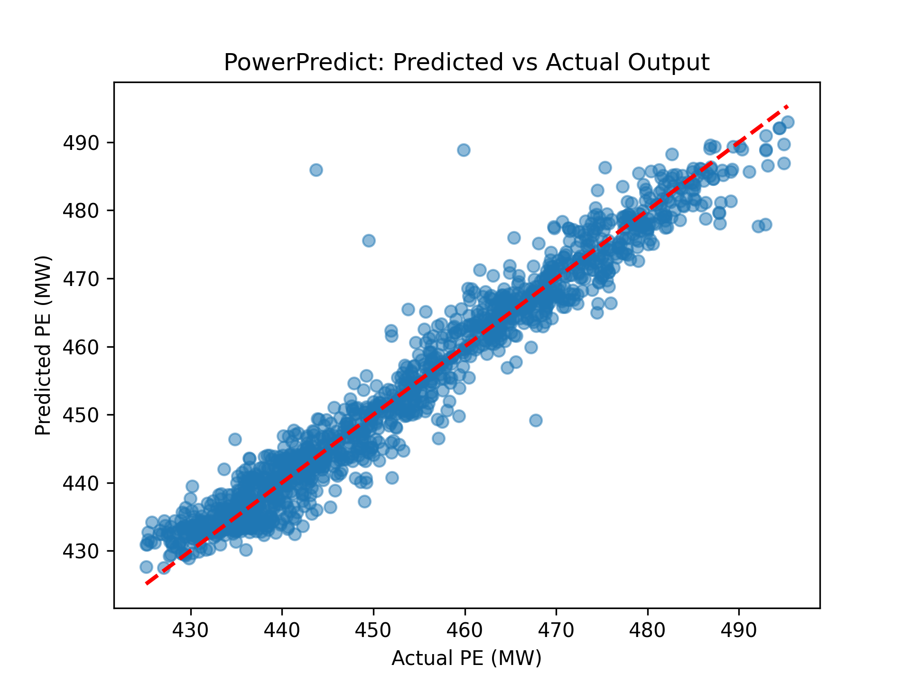

# PowerPredict: AI-Driven Energy Forecasting Tool

An AI-powered solution to predict electrical energy output (PE) for Combined Cycle Power Plants, optimizing operational efficiency. Built as an MVP by an AI Product Manager to showcase end-to-end ML development.

## Problem
Combined Cycle Power Plants need accurate hourly output predictions (420-495 MW) to reduce costs and improve planning. This project tackles that with machine learning.

## Solution
- **Type**: Supervised regression model.
- **Features**: Temperature (T), Ambient Pressure (AP), Relative Humidity (RH), Exhaust Vacuum (V).
- **Tech Stack**: Python, VS Code, `pandas`, `scikit-learn`, `numpy`, `matplotlib`.
- **Approach**:
  - Data: 9,568 hourly sensor readings.
  - Split: 70% train, 15% validation, 15% test (fixed validation set).
  - Models: Linear Regression (RMSE 4.56 MW) vs. Random Forest (RMSE 3.43 MW).
  - Selected: Random Forest (Test RMSE 3.67 MW).
- **Output**: Predictions with 3.67 MW error (~1% of range).

## Demo

*Predicted vs. actual output—tight clustering shows reliability.*

## Key Insights
- Temperature drives 91.7% of predictions (via `scikit-learn` feature importance).
- Actionable for plant tuning and cost savings.

## Setup
1. Clone repo: `git clone https://github.com/JFLman/PowerPredict.git`
2. Install dependencies: `pip install -r requirements.txt`
3. Run: `python code/ccpp_model.py --data data/CCPP_data.csv`

## API Usage
Run the API to predict energy output in real-time:
1. Start the server: `python code/api.py`
2. Send a POST request to `http://localhost:5000/predict`:
   ```json
   {
     "T": 25.0,
     "AP": 1013.0,
     "RH": 60.0,
     "V": 40.0
   }
   {
  "prediction": 455.383,
  "unit": "MW"
    }

## Product Roadmap
- **MVP**: Current model with static data.
- **Done**: Real-time API integration (see API Usage).
- **Next**: UI dashboard, multi-plant scaling, model persistence (save/load).

## Presentation
See [presentation.pdf](assets/presentation.pdf) for C-suite pitch.

## Why This Matters
As an AI Product Manager, I designed this to bridge technical execution (ML modeling) with business impact (efficiency gains), ready for production deployment.